<div align="center">

<!-- 
═══════════════════════════════════════════════════════════════════════
   ✨ CUSTOMIZATION NOTE ✨
   
   This is a template profile - please personalize it!
   
   🔧 Key areas to update:
   - TypeScript code block (lines 20-28): Update name, role, focus areas
   - Social links (lines 228-233): Replace placeholder URLs with your actual profiles
   - Tech stack: Add/remove badges based on your actual skills
   
   📖 See PREVIEW.md for detailed customization guide
═══════════════════════════════════════════════════════════════════════
-->

<!-- Dynamic Typing Header -->


<!-- Wave Animation -->


</div>

---

<div align="center">

### 🚀 **About Me**

</div>

```typescript
const ak_asu = {
    name: "Aakash Khepar",
    role: "Software Engineer",
    location: "🌍 Building from anywhere",
    education: "MS in Computer Science",
    currentFocus: ["Full-Stack Development", "Cloud Architecture", "AI/ML"],
    lifePhilosophy: "Code, Create, Innovate, Repeat 🔄"
};
```

<div align="center">

<!-- Profile Views Counter -->


<!-- Portfolio Link -->
<a href="https://ak-asu.github.io/Portfolio/" target="_blank">
    
</a>

</div>

---

## 💻 **Tech Stack & Skills**

<details open>
<summary><b>🎨 Frontend Development</b></summary>
<br/>


</details>

<details open>
<summary><b>⚙️ Backend Development</b></summary>
<br/>


</details>

<details open>
<summary><b>🗄️ Database & Storage</b></summary>
<br/>


</details>

<details open>
<summary><b>☁️ Cloud & DevOps</b></summary>
<br/>


</details>

<details open>
<summary><b>🛠️ Tools & Platforms</b></summary>
<br/>


</details>

<details open>
<summary><b>🤖 AI/ML & Data Science</b></summary>
<br/>


</details>

---

## 📊 **GitHub Analytics Dashboard**

<div align="center">

<!-- GitHub Stats Cards (generated by GitHub Actions - see .github/workflows/stats.yml) -->



<!-- Top Languages (generated by GitHub Actions - see .github/workflows/stats.yml) -->


<!-- Contribution Graph -->


<!-- Trophy -->


</div>

---

## 🎯 **What I'm Currently Up To**

<table>
<tr>
<td width="50%">

### 🔭 Working On
- 🚀 Building scalable web applications
- 🌐 Exploring cloud-native architectures
- 📱 Mobile app development with cross-platform frameworks
- 🔐 Implementing secure authentication systems

</td>
<td width="50%">

### 🌱 Learning & Growing
- 🧠 Advanced system design patterns
- 🤖 Machine learning and AI integration
- ⚡ Performance optimization techniques
- 🔧 Microservices architecture

</td>
</tr>
</table>

---

## 💡 **Interests & Capabilities**

<div align="center">

| **Domain** | **Skills & Interests** |
|:---:|:---|
| 🎨 **Design** | UI/UX Design, Responsive Layouts, Design Systems, Accessibility |
| 🏗️ **Architecture** | Microservices, Serverless, Event-Driven, Scalable Systems |
| 🔒 **Security** | OAuth, JWT, Encryption, Secure Coding Practices, Penetration Testing |
| 📊 **Analytics** | Data Visualization, Business Intelligence, Performance Metrics |
| 🌐 **Web3** | Blockchain, Smart Contracts, Decentralized Applications |
| 🎮 **Game Dev** | Game Design, Unity, Unreal Engine, Physics Simulations |
| 📝 **Content** | Technical Writing, Documentation, Blogging, Knowledge Sharing |
| 🤝 **Collaboration** | Agile/Scrum, Team Leadership, Code Reviews, Mentoring |

</div>

---

## 🏆 **Achievements & Highlights**

```javascript
const achievements = {
    openSource: "Active contributor to various open-source projects",
    hackathons: "Participated in multiple coding competitions",
    certifications: "Continuous learning through professional certifications",
    mentorship: "Helping fellow developers grow and succeed",
    problemSolving: "Solved 500+ algorithmic challenges across platforms"
};
```

---

## 🤝 **Let's Connect!**

<div align="center">

[](https://linkedin.com/in/aakash-khepar)
[](https://ak-asu.github.io/Portfolio/)

</div>

---

## 📈 **Contribution Activity**

<div align="center">

<!-- GitHub Metrics -->


</div>

---

## 💭 **Random Dev Quote**

<div align="center">


</div>

---

## 🐍 **Watch the Snake Eat My Contributions!**

<div align="center">


<sub>*Note: Snake animation may take a moment to load or may require GitHub Actions setup*</sub>

</div>

---

<div align="center">

### 💬 **"Talk is cheap. Show me the code."** - Linus Torvalds

---


**⭐ From [ak-asu](https://github.com/ak-asu) with ❤️**

</div>
