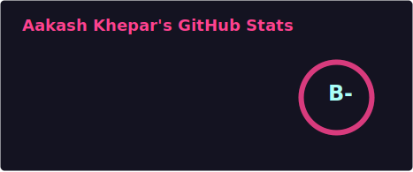
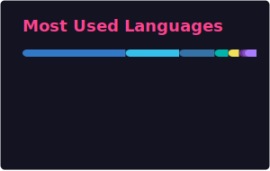

<div align="center">

<!-- 
═══════════════════════════════════════════════════════════════════════
   ✨ CUSTOMIZATION NOTE ✨
   
   This is a template profile - please personalize it!
   
   🔧 Key areas to update:
   - TypeScript code block (lines 20-28): Update name, role, focus areas
   - Social links (lines 228-233): Replace placeholder URLs with your actual profiles
   - Tech stack: Add/remove badges based on your actual skills
   
   📖 See PREVIEW.md for detailed customization guide
═══════════════════════════════════════════════════════════════════════
-->

<!-- Dynamic Typing Header -->


<!-- Wave Animation -->


</div>

---

<div align="center">

### 🚀 **About Me**

</div>

```typescript
const ak_asu = {
    name: "Aakash Khepar",
    role: "Software Engineer",
    location: "🌍 Building from anywhere",
    education: "MS in Computer Science",
    currentFocus: ["Full-Stack Development", "Cloud Architecture", "AI/ML"],
    lifePhilosophy: "Code, Create, Innovate, Repeat 🔄"
};
```

<div align="center">

<!-- Profile Views Counter -->


<!-- Portfolio Link -->
<a href="https://ak-asu.github.io/Portfolio/" target="_blank">
    
</a>

</div>

---

## 🗂️ **Projects**

<!-- PROJECTS:START -->

### <a name="ai-ml"></a>🤖 AI / ML & Research
<details open>
<summary><b>4 projects</b></summary>
<br/>
<table>
  <tr>
    <td width="50%" valign="top">
<a href="https://github.com/ak-asu/VisionVault">
  
</a>
<h4><a href="https://github.com/ak-asu/VisionVault">Visionvault</a></h4>
<p>Automatically blurs faces in videos for privacy, allowing secure access for authorized users. Ideal for personal safety and content moderation.</p>
<p> &nbsp; <code>Face Detection</code> <code>Cryptography</code> <code>Privacy</code> <code>Computer Vision</code></p>
<br clear="left"/>
    </td>
    <td width="50%" valign="top">
<a href="https://github.com/ak-asu/EnergyHackathon">
  
</a>
<h4><a href="https://github.com/ak-asu/EnergyHackathon">Energyhackathon</a></h4>
<p>Scores potential data center sites in Texas by evaluating land, gas, and power factors using AI models.</p>
<p>&nbsp;&nbsp; &nbsp; <code>Machine Learning</code> <code>Data Center</code> <code>Site Selection</code></p>
<br clear="left"/>
    </td>
  </tr>
  <tr>
    <td width="50%" valign="top">
<a href="https://github.com/ak-asu/ResumeBotX">
  
</a>
<h4><a href="https://github.com/ak-asu/ResumeBotX">Resumebotx</a></h4>
<p>ResumeBotX automates job applications by generating tailored resumes and cover letters, enhancing job seekers' chances of success.</p>
<p>&nbsp;&nbsp; &nbsp; <code>Job Automation</code> <code>Resume Builder</code> <code>AI Scraping</code></p>
<br clear="left"/>
    </td>
    <td width="50%" valign="top">
<a href="https://github.com/ak-asu/GenZents-HeritageSquareFounda">
  
</a>
<h4><a href="https://github.com/ak-asu/GenZents-HeritageSquareFounda">Genzents Heritagesquarefounda</a></h4>
<p>Archyx AI simplifies heritage archive management by enabling users to ask questions and find documents via natural language.</p>
<p>&nbsp;&nbsp; &nbsp; <code>Conversational AI</code> <code>Google Drive</code> <code>TypeScript</code></p>
<br clear="left"/>
    </td>
  </tr>
</table>
</details>


### <a name="web"></a>🌐 Web & Full-Stack
<details open>
<summary><b>7 projects</b></summary>
<br/>
<table>
  <tr>
    <td width="50%" valign="top">
<a href="https://github.com/ak-asu/web-dev-skill">
  
</a>
<h4><a href="https://github.com/ak-asu/web-dev-skill">Web Dev Skill</a></h4>
<p>Build a professional portfolio website while mastering web development fundamentals and best practices. Great for improving your skills!</p>
<p>&nbsp;&nbsp; &nbsp; <code>Web Development</code> <code>React</code> <code>TypeScript</code> <code>Tailwind CSS</code></p>
<br clear="left"/>
    </td>
    <td width="50%" valign="top">
<a href="https://github.com/ak-asu/reddiant">
  
</a>
<h4><a href="https://github.com/ak-asu/reddiant">Reddiant</a></h4>
<p>A competitive platform where players engage in daily elimination games until one winner remains, fostering community interaction.</p>
<p>&nbsp;&nbsp; &nbsp; <code>Competition Platform</code> <code>Game Development</code> <code>Community Engagement</code></p>
<br clear="left"/>
    </td>
  </tr>
  <tr>
    <td width="50%" valign="top">
<a href="https://github.com/ak-asu/superagent">
  
</a>
<h4><a href="https://github.com/ak-asu/superagent">Superagent</a></h4>
<p>Superagent simplifies HTTP requests, making it easy to send and receive data from APIs. It's lightweight and user-friendly.</p>
<p><code>HTTP Requests</code> <code>API Integration</code> <code>JavaScript</code></p>
<br clear="left"/>
    </td>
    <td width="50%" valign="top">
<a href="https://github.com/ak-asu/Portfolio">
  
</a>
<h4><a href="https://github.com/ak-asu/Portfolio">Portfolio</a></h4>
<p>An interactive web portfolio showcasing skills and projects with engaging UI/UX, including 3D elements and a chat assistant.</p>
<p>&nbsp;&nbsp; &nbsp; <code>Interactive Portfolio</code> <code>UI/UX</code> <code>React</code> <code>TypeScript</code></p>
<br clear="left"/>
    </td>
  </tr>
  <tr>
    <td width="50%" valign="top">
<a href="https://github.com/ak-asu/book-recommender">
  
</a>
<h4><a href="https://github.com/ak-asu/book-recommender">Book Recommender</a></h4>
<p>BookTrack recommends books using AI, allowing users to search by mood or genre for personalized reading lists.</p>
<p>&nbsp;&nbsp; &nbsp; <code>Book Recommendations</code> <code>AI</code> <code>Full-Stack</code> <code>TypeScript</code></p>
<br clear="left"/>
    </td>
    <td width="50%" valign="top">
<a href="https://github.com/ak-asu/Zeneuro">
  
</a>
<h4><a href="https://github.com/ak-asu/Zeneuro">Zeneuro</a></h4>
<p>Zeneuro is an AI-driven mental health app offering mood tracking and self-help tools for personal wellness. It enhances emotional support accessibility.</p>
<p>&nbsp;&nbsp; &nbsp; <code>Mental Health</code> <code>AI Chatbot</code> <code>Self-Care</code> <code>Progress Tracking</code></p>
<br clear="left"/>
    </td>
  </tr>
  <tr>
    <td width="50%" valign="top">
<a href="https://github.com/ak-asu/shadowpath">
  
</a>
<h4><a href="https://github.com/ak-asu/shadowpath">Shadowpath</a></h4>
<p>ShadowPath provides shade-aware routing on ASU Tempe campus, optimizing paths for thermal comfort and minimizing sun exposure.</p>
<p>&nbsp;&nbsp; &nbsp; <code>Routing</code> <code>Weather Data</code> <code>User Experience</code></p>
<br clear="left"/>
    </td>
    <td width="50%"></td>
  </tr>
</table>
</details>


### <a name="tools"></a>🛠️ Tools & Utilities
<details open>
<summary><b>9 projects</b></summary>
<br/>
<table>
  <tr>
    <td width="50%" valign="top">
<a href="https://github.com/ak-asu/notesummarizer">
  
</a>
<h4><a href="https://github.com/ak-asu/notesummarizer">Notesummarizer</a></h4>
<p>Summarizes notes from various sources into concise formats, enhancing productivity through voiceovers and export options.</p>
<p> &nbsp; <code>Note Summarization</code> <code>Voiceover</code> <code>Text Processing</code></p>
<br clear="left"/>
    </td>
    <td width="50%" valign="top">
<a href="https://github.com/ak-asu/public-releases">
  
</a>
<h4><a href="https://github.com/ak-asu/public-releases">Public Releases</a></h4>
<p>Provides a collection of downloadable software solutions for various needs, simplifying access to essential tools.</p>
<p><code>Software Distribution</code> <code>Downloadable Tools</code> <code>Utility Software</code></p>
<br clear="left"/>
    </td>
  </tr>
  <tr>
    <td width="50%" valign="top">
<a href="https://github.com/ak-asu/skills-code-with-codespaces">
  
</a>
<h4><a href="https://github.com/ak-asu/skills-code-with-codespaces">Skills Code With Codespaces</a></h4>
<p>Clone repository for GitHub Codespaces, enabling streamlined coding and customization for developers. Enhances productivity and learning experience.</p>
<p> &nbsp; <code>GitHub Codespaces</code> <code>Shell Scripting</code> <code>Development Environment</code></p>
<br clear="left"/>
    </td>
    <td width="50%" valign="top">
<a href="https://github.com/ak-asu/skills-copilot-codespaces-vscode">
  
</a>
<h4><a href="https://github.com/ak-asu/skills-copilot-codespaces-vscode">Skills Copilot Codespaces Vscode</a></h4>
<p>This project replicates GitHub Copilot's functionality in VS Code, enhancing coding efficiency with intelligent suggestions.</p>
<p>&nbsp; &nbsp; <code>Code Autocompletion</code> <code>VS Code</code> <code>JavaScript</code></p>
<br clear="left"/>
    </td>
  </tr>
  <tr>
    <td width="50%" valign="top">
<a href="https://github.com/ak-asu/resumeclarity-skills">
  
</a>
<h4><a href="https://github.com/ak-asu/resumeclarity-skills">Resumeclarity Skills</a></h4>
<p>Automates job search by scoring fits, generating resumes, and keeping your data local. Empower your job hunt securely.</p>
<p>&nbsp; &nbsp; <code>Job Search Automation</code> <code>Resume Builder</code> <code>Local Data Processing</code></p>
<br clear="left"/>
    </td>
    <td width="50%" valign="top">
<a href="https://github.com/ak-asu/basicparser">
  
</a>
<h4><a href="https://github.com/ak-asu/basicparser">Basicparser</a></h4>
<p>This C++ parser interprets polynomial languages, validating syntax and executing tasks while tracking variables and errors.</p>
<p> &nbsp; <code>C++</code> <code>Parser</code> <code>Compiler</code> <code>Semantic Validation</code></p>
<br clear="left"/>
    </td>
  </tr>
  <tr>
    <td width="50%" valign="top">
<a href="https://github.com/ak-asu/parsergenerator">
  
</a>
<h4><a href="https://github.com/ak-asu/parsergenerator">Parsergenerator</a></h4>
<p>This C++ tool analyzes context-free grammars and performs transformations like nullable analysis and left recursion removal. Ideal for learning and testing.</p>
<p> &nbsp; <code>Grammar Analysis</code> <code>C++</code> <code>CLI Tool</code></p>
<br clear="left"/>
    </td>
    <td width="50%" valign="top">
<a href="https://github.com/ak-asu/Local-Image-Finder">
  
</a>
<h4><a href="https://github.com/ak-asu/Local-Image-Finder">Local Image Finder</a></h4>
<p>Search your local image library using AI for intuitive, privacy-focused results without cloud dependency.</p>
<p>&nbsp;&nbsp; &nbsp; <code>Image Search</code> <code>AI</code> <code>Desktop App</code> <code>Privacy</code></p>
<br clear="left"/>
    </td>
  </tr>
  <tr>
    <td width="50%" valign="top">
<a href="https://github.com/ak-asu/cloudforge">
  
</a>
<h4><a href="https://github.com/ak-asu/cloudforge">Cloudforge</a></h4>
<p>CloudForge transforms product requirements into live AWS infrastructure using a knowledge graph for accurate architecture decisions.</p>
<p>&nbsp;&nbsp; &nbsp; <code>Infrastructure as Code</code> <code>AWS</code> <code>Knowledge Graph</code></p>
<br clear="left"/>
    </td>
    <td width="50%"></td>
  </tr>
</table>
</details>


### <a name="other"></a>📦 Other
<details open>
<summary><b>19 projects</b></summary>
<br/>
<table>
  <tr>
    <td width="50%" valign="top">
<a href="https://github.com/ak-asu/Tic-Tac-Toe">
  
</a>
<h4><a href="https://github.com/ak-asu/Tic-Tac-Toe">Tic Tac Toe</a></h4>
<p>A Tic-Tac-Toe Single and Multiplayer Game with Bluetooth Connectivity</p>
<p></p>
<br clear="left"/>
    </td>
    <td width="50%" valign="top">
<a href="https://github.com/ak-asu/Context-Monitor">
  
</a>
<h4><a href="https://github.com/ak-asu/Context-Monitor">Context Monitor</a></h4>
<p>Context monitoring android application</p>
<p></p>
<br clear="left"/>
    </td>
  </tr>
  <tr>
    <td width="50%" valign="top">
<a href="https://github.com/ak-asu/Arduino">
  
</a>
<h4><a href="https://github.com/ak-asu/Arduino">Arduino</a></h4>
<p>Arduino projects</p>
<p></p>
<br clear="left"/>
    </td>
    <td width="50%" valign="top">
<a href="https://github.com/ak-asu/basiccompiler">
  
</a>
<h4><a href="https://github.com/ak-asu/basiccompiler">Basiccompiler</a></h4>
<p>A simple compiler that translates basic programming language syntax into machine code, demonstrating foundational compiler design principles.</p>
<p> &nbsp; <code>Compiler Design</code> <code>C++</code> <code>Programming Language</code></p>
<br clear="left"/>
    </td>
  </tr>
  <tr>
    <td width="50%" valign="top">
<a href="https://github.com/ak-asu/k8squest">
  
</a>
<h4><a href="https://github.com/ak-asu/k8squest">K8Squest</a></h4>
<p>K8sQuest is a hands-on game for learning Kubernetes through real-world troubleshooting challenges. It’s engaging and cost-free.</p>
<p> &nbsp; <code>Kubernetes</code> <code>Learning Game</code> <code>Troubleshooting</code> <code>Local Development</code></p>
<br clear="left"/>
    </td>
    <td width="50%" valign="top">
<a href="https://github.com/ak-asu/SmallProjects">
  
</a>
<h4><a href="https://github.com/ak-asu/SmallProjects">Smallprojects</a></h4>
<p>A collection of small projects showcasing various programming concepts and technologies for learning and experimentation.</p>
<p>&nbsp;&nbsp; &nbsp; <code>Learning Projects</code> <code>Python</code> <code>Programming Concepts</code></p>
<br clear="left"/>
    </td>
  </tr>
  <tr>
    <td width="50%" valign="top">
<a href="https://github.com/ak-asu/shadow-committee">
  
</a>
<h4><a href="https://github.com/ak-asu/shadow-committee">Shadow Committee</a></h4>
<p>Shadow Committee — a TypeScript project by ak-asu.</p>
<p>&nbsp;&nbsp;</p>
<br clear="left"/>
    </td>
    <td width="50%" valign="top">
<a href="https://github.com/ak-asu/geeky">
  
</a>
<h4><a href="https://github.com/ak-asu/geeky">Geeky</a></h4>
<p>Geeky transforms scattered multimedia notes into personalized learning Shorts, enhancing self-education and retention through adaptive recommendations.</p>
<p>&nbsp;&nbsp; &nbsp; <code>Education Technology</code> <code>Personalized Learning</code> <code>Knowledge Graph</code></p>
<br clear="left"/>
    </td>
  </tr>
  <tr>
    <td width="50%" valign="top">
<a href="https://github.com/ak-asu/download-codewiki">
  
</a>
<h4><a href="https://github.com/ak-asu/download-codewiki">Download Codewiki</a></h4>
<p>Download Codewiki — a JavaScript project by ak-asu.</p>
<p></p>
<br clear="left"/>
    </td>
    <td width="50%" valign="top">
<a href="https://github.com/ak-asu/visionforge">
  
</a>
<h4><a href="https://github.com/ak-asu/visionforge">Visionforge</a></h4>
<p>Visionforge — a TypeScript project by ak-asu.</p>
<p>&nbsp;&nbsp;</p>
<br clear="left"/>
    </td>
  </tr>
  <tr>
    <td width="50%" valign="top">
<a href="https://github.com/ak-asu/ProjectIAM">
  
</a>
<h4><a href="https://github.com/ak-asu/ProjectIAM">Projectiam</a></h4>
<p>Unicredify enables universities to issue and verify academic credentials securely using decentralized technology, enhancing trust and privacy for students and employers.</p>
<p>&nbsp;&nbsp; &nbsp; <code>Decentralized Identity</code> <code>Verifiable Credentials</code> <code>Blockchain</code> <code>Privacy Preservation</code></p>
<br clear="left"/>
    </td>
    <td width="50%" valign="top">
<a href="https://github.com/ak-asu/carecallerai">
  
</a>
<h4><a href="https://github.com/ak-asu/carecallerai">Carecallerai</a></h4>
<p>Carecallerai — a TypeScript project by ak-asu.</p>
<p>&nbsp;&nbsp;</p>
<br clear="left"/>
    </td>
  </tr>
  <tr>
    <td width="50%" valign="top">
<a href="https://github.com/ak-asu/docuer">
  
</a>
<h4><a href="https://github.com/ak-asu/docuer">Docuer</a></h4>
<p>Docuer transforms documentation into personalized learning courses using AI, making learning engaging and efficient. It enhances knowledge retention through a dynamic knowledge graph.</p>
<p>&nbsp;&nbsp; &nbsp; <code>AI</code> <code>Knowledge Graph</code> <code>Personalized Learning</code> <code>Web Application</code></p>
<br clear="left"/>
    </td>
    <td width="50%" valign="top">
<a href="https://github.com/ak-asu/moneynest">
  
</a>
<h4><a href="https://github.com/ak-asu/moneynest">Moneynest</a></h4>
<p>Moneynest — a TypeScript project by ak-asu.</p>
<p>&nbsp;&nbsp;</p>
<br clear="left"/>
    </td>
  </tr>
  <tr>
    <td width="50%" valign="top">
<a href="https://github.com/ak-asu/GameGenAI">
  
</a>
<h4><a href="https://github.com/ak-asu/GameGenAI">Gamegenai</a></h4>
<p>Gamegenai — a TypeScript project by ak-asu.</p>
<p>&nbsp;&nbsp;</p>
<br clear="left"/>
    </td>
    <td width="50%" valign="top">
<a href="https://github.com/ak-asu/elektraz">
  
</a>
<h4><a href="https://github.com/ak-asu/elektraz">Elektraz</a></h4>
<p>Elektraz — a Python project by ak-asu.</p>
<p>&nbsp;</p>
<br clear="left"/>
    </td>
  </tr>
  <tr>
    <td width="50%" valign="top">
<a href="https://github.com/ak-asu/Coderz-NMTSAEducationPlatfo">
  
</a>
<h4><a href="https://github.com/ak-asu/Coderz-NMTSAEducationPlatfo">Coderz Nmtsaeducationplatfo</a></h4>
<p>Repository for 2025_fall Hackathon, Coderz Team</p>
<p>&nbsp;&nbsp;</p>
<br clear="left"/>
    </td>
    <td width="50%" valign="top">
<a href="https://github.com/ak-asu/read4ever">
  
</a>
<h4><a href="https://github.com/ak-asu/read4ever">Read4Ever</a></h4>
<p>Read4Ever — a Dart project by ak-asu.</p>
<p>&nbsp;&nbsp;</p>
<br clear="left"/>
    </td>
  </tr>
  <tr>
    <td width="50%" valign="top">
<a href="https://github.com/ak-asu/24-sync-solve">
  
</a>
<h4><a href="https://github.com/ak-asu/24-sync-solve">24 Sync Solve</a></h4>
<p>2026_spring_wics_asu Hackathon - Team Sync&Solve</p>
<p>&nbsp;&nbsp;</p>
<br clear="left"/>
    </td>
    <td width="50%"></td>
  </tr>
</table>
</details>

<!-- PROJECTS:END -->

---

## 💻 **Tech Stack & Skills**

<!-- TECHSTACK:START -->
> Most used: **TypeScript** · **Python** · **JavaScript**

<details open>
<summary><b>Frontend</b></summary>
<br/>

            

</details>

<details open>
<summary><b>Backend</b></summary>
<br/>

           

</details>

<details open>
<summary><b>Database</b></summary>
<br/>

      

</details>

<details open>
<summary><b>Cloud & DevOps</b></summary>
<br/>

        

</details>

<details open>
<summary><b>Tools</b></summary>
<br/>

       

</details>

<details open>
<summary><b>AI/ML</b></summary>
<br/>

     

</details>

<!-- TECHSTACK:END -->

---

## 📊 **GitHub Analytics Dashboard**

<div align="center">

<!-- GitHub Stats Cards (generated by GitHub Actions - see .github/workflows/stats.yml) -->



<!-- Top Languages (generated by GitHub Actions - see .github/workflows/stats.yml) -->


<!-- Trophy -->
<!--  -->

</div>

---

## 🎯 **What I'm Currently Up To**

<table>
<tr>
<td width="50%">

<!-- CURRENT:START -->
### 🔭 Working On
- **[Cloudforge](https://github.com/ak-asu/cloudforge)** — CloudForge transforms product requirements into live AWS infrastructure using a knowledge graph for accurate architecture decisions.
- **[24 Sync Solve](https://github.com/ak-asu/24-sync-solve)** — 2026_spring_wics_asu Hackathon - Team Sync&Solve
- **[Read4Ever](https://github.com/ak-asu/read4ever)** — Read4Ever — a Dart project by ak-asu.
- **[Shadowpath](https://github.com/ak-asu/shadowpath)** — ShadowPath provides shade-aware routing on ASU Tempe campus, optimizing paths for thermal comfort and minimizing sun exposure.
<!-- CURRENT:END -->

</td>
<td width="50%">

### 🌱 Learning & Growing
- 🧠 Advanced system design patterns
- 🤖 Machine learning and AI integration
- ⚡ Performance optimization techniques
- 🔧 Microservices architecture

</td>
</tr>
</table>

---

## 💡 **Interests & Capabilities**

<div align="center">

| **Domain** | **Skills & Interests** |
|:---:|:---|
| 🎨 **Design** | UI/UX Design, Responsive Layouts, Design Systems, Accessibility |
| 🏗️ **Architecture** | Microservices, Serverless, Event-Driven, Scalable Systems |
| 📊 **Analytics** | Data Visualization, Business Intelligence, Performance Metrics |
| 🎮 **Game Dev** | Game Design, Unity, Unreal Engine, Physics Simulations |
| 📝 **Content** | Technical Writing, Documentation, Blogging, Knowledge Sharing |
| 🤝 **Collaboration** | Agile/Scrum, Team Leadership, Code Reviews, Mentoring |

</div>

---

## 💬 **Guestbook**

<!-- GUESTBOOK:START -->
## 💬 Guestbook

👋 [Be the first to leave a note!](https://github.com/ak-asu/ak-asu/discussions/4)
<!-- GUESTBOOK:END -->

---

## 🤝 **Let's Connect!**

<div align="center">

[](https://linkedin.com/in/aakash-khepar)
[](https://ak-asu.github.io/Portfolio/)

</div>

---

## 📈 **Contribution Activity**

<div align="center">

<!-- GitHub Metrics -->


</div>

---

## 💭 **Random Dev Quote**

<div align="center">


</div>

---

## 🐍 **Watch the Snake Eat My Contributions!**

<div align="center">


<sub>*Note: Snake animation may take a moment to load or may require GitHub Actions setup*</sub>

</div>

---

<div align="center">

### 💬 **"Talk is cheap. Show me the code."** - Linus Torvalds

---


**⭐ From [ak-asu](https://github.com/ak-asu) with ❤️**

</div>
